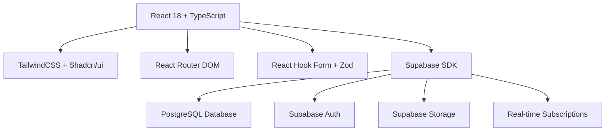
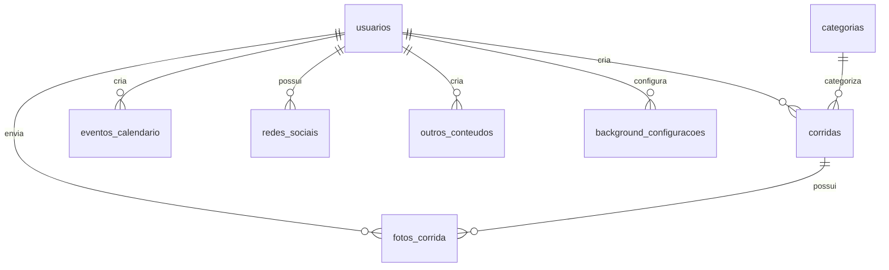

# 🏃‍♂️ Pace Ram - Apresentação Completa do Aplicativo

## 📋 Índice
1. [Introdução e Visão Geral](#introdução-e-visão-geral)
2. [Funcionalidades Principais](#funcionalidades-principais)
3. [Arquitetura Técnica](#arquitetura-técnica)
4. [Estrutura do Banco de Dados](#estrutura-do-banco-de-dados)
5. [Funcionalidades do Frontend](#funcionalidades-do-frontend)
6. [Funcionalidades do Backend](#funcionalidades-do-backend)
7. [Seções e Módulos](#seções-e-módulos)
8. [Recursos Avançados](#recursos-avançados)
9. [Segurança e Performance](#segurança-e-performance)
10. [Tecnologias e Dependências](#tecnologias-e-dependências)

---

## 🎯 Introdução e Visão Geral

### O que é o Pace Ram?

O **Pace Ram** é uma plataforma completa e moderna para gestão de corridas, fotos de eventos e calendário de competições esportivas. É uma solução digital robusta que centraliza informações sobre corridas e eventos esportivos, facilitando o acesso a fotos profissionais e mantendo a comunidade de corredores sempre informada sobre próximas competições.

### Objetivo e Propósito

- **Centralizar informações** sobre corridas e eventos esportivos
- **Facilitar o acesso** a fotos profissionais de eventos
- **Manter a comunidade** de corredores informada sobre competições
- **Simplificar a gestão** de eventos para organizadores
- **Criar uma experiência** moderna e intuitiva para todos os usuários

### Público-Alvo

| Perfil | Descrição | Principais Necessidades |
|--------|-----------|------------------------|
| **Corredores** | Atletas amadores e profissionais | Encontrar eventos, visualizar fotos, descobrir competições |
| **Organizadores** | Empresas e pessoas que organizam corridas | Divulgar eventos, gerenciar fotos, promover competições |
| **Fotógrafos** | Profissionais que cobrem eventos esportivos | Compartilhar fotos, organizar galerias por evento |
| **Administradores** | Gestores da plataforma | Controlar conteúdo, gerenciar usuários, moderar publicações |

---

## ⚡ Funcionalidades Principais

### 🏃 Gestão de Corridas
- **Criação e edição** de eventos de corrida
- **Categorização** por tipo (Maratona, 10K, 5K, Trail Run, etc.)
- **Upload de imagens** principais para cada evento
- **Links externos** para inscrições
- **Controle de publicação** (rascunho/publicado)
- **Informações detalhadas**: data, local, descrição

### 📅 Calendário de Eventos
- **Visualização cronológica** de eventos futuros
- **Filtros por categoria** e localização
- **Links diretos** para inscrições
- **Contagem regressiva** para eventos próximos
- **Integração** com eventos de corrida

### 📸 Galeria de Fotos
- **Upload seguro** de imagens para Supabase Storage
- **Organização por evento** específico
- **Sistema de aprovação** para moderação
- **Busca por número** de peito do corredor
- **Visualização em grid** responsivo
- **Download** de fotos pelos usuários

### 🔐 Sistema de Autenticação
- **Login seguro** com email/senha
- **Registro de novos usuários**
- **Recuperação de senha**
- **Sessões persistentes** com "lembrar-me"
- **Controle de expiração** de sessão
- **Diferentes níveis** de permissão

### 🎛️ Dashboard Administrativo
- **Painel de controle** completo
- **Gestão de usuários** e permissões
- **Moderação de conteúdo**
- **Estatísticas** de uso
- **Configurações** da plataforma

---

## 🏗️ Arquitetura Técnica

### Stack Tecnológico



### Estrutura do Frontend
- **Framework**: React 18 com TypeScript
- **Build Tool**: Vite para desenvolvimento rápido
- **Styling**: TailwindCSS + Shadcn/ui components
- **Roteamento**: React Router DOM v6
- **Formulários**: React Hook Form + Zod validation
- **Estado**: React Query para cache e sincronização
- **Notificações**: Sonner para toasts

### Backend e Banco de Dados
- **Backend-as-a-Service**: Supabase
- **Banco de Dados**: PostgreSQL com Row Level Security
- **Autenticação**: Supabase Auth com JWT
- **Storage**: Supabase Storage para imagens
- **Real-time**: Subscriptions para atualizações em tempo real

---

## 🗄️ Estrutura do Banco de Dados

### Tabelas Principais

#### 👥 usuarios
```sql
CREATE TABLE usuarios (
    id UUID PRIMARY KEY DEFAULT gen_random_uuid(),
    email VARCHAR(255) UNIQUE NOT NULL,
    nome VARCHAR(100) NOT NULL,
    senha_hash VARCHAR(255) NOT NULL,
    tipo_usuario VARCHAR(20) DEFAULT 'usuario' CHECK (tipo_usuario IN ('admin', 'editor', 'usuario')),
    ativo BOOLEAN DEFAULT true,
    criado_em TIMESTAMP WITH TIME ZONE DEFAULT NOW(),
    atualizado_em TIMESTAMP WITH TIME ZONE DEFAULT NOW()
);
```

#### 🏃 corridas
```sql
CREATE TABLE corridas (
    id UUID PRIMARY KEY DEFAULT gen_random_uuid(),
    titulo VARCHAR(200) NOT NULL,
    data_evento DATE NOT NULL,
    local VARCHAR(200) NOT NULL,
    descricao TEXT,
    imagem_principal VARCHAR(500),
    link_externo VARCHAR(500),
    texto_rodape VARCHAR(100),
    categoria_id UUID REFERENCES categorias(id),
    criado_por UUID REFERENCES usuarios(id),
    publicado BOOLEAN DEFAULT false,
    criado_em TIMESTAMP WITH TIME ZONE DEFAULT NOW(),
    atualizado_em TIMESTAMP WITH TIME ZONE DEFAULT NOW()
);
```

#### 📅 eventos_calendario
```sql
CREATE TABLE eventos_calendario (
    id UUID PRIMARY KEY DEFAULT gen_random_uuid(),
    titulo VARCHAR(200) NOT NULL,
    data_evento DATE NOT NULL,
    local VARCHAR(200),
    descricao TEXT,
    link_externo VARCHAR(500),
    status VARCHAR(50),
    regiao VARCHAR(100),
    distancia VARCHAR(50),
    horario_participantes TIME,
    criado_por UUID REFERENCES usuarios(id),
    publicado BOOLEAN DEFAULT false,
    criado_em TIMESTAMP WITH TIME ZONE DEFAULT NOW(),
    atualizado_em TIMESTAMP WITH TIME ZONE DEFAULT NOW()
);
```

#### 📸 fotos_corrida
```sql
CREATE TABLE fotos_corrida (
    id UUID PRIMARY KEY DEFAULT gen_random_uuid(),
    corrida_id UUID REFERENCES corridas(id),
    url_foto VARCHAR(500) NOT NULL,
    titulo VARCHAR(200),
    descricao TEXT,
    numero_peito VARCHAR(20),
    enviado_por UUID REFERENCES usuarios(id),
    aprovado BOOLEAN DEFAULT false,
    criado_em TIMESTAMP WITH TIME ZONE DEFAULT NOW()
);
```

#### 🏷️ categorias
```sql
CREATE TABLE categorias (
    id UUID PRIMARY KEY DEFAULT gen_random_uuid(),
    nome VARCHAR(100) UNIQUE NOT NULL,
    descricao TEXT,
    cor_hex VARCHAR(7) DEFAULT '#3B82F6',
    ativo BOOLEAN DEFAULT true,
    criado_em TIMESTAMP WITH TIME ZONE DEFAULT NOW()
);
```

#### 🎨 background_configuracoes
```sql
CREATE TABLE background_configuracoes (
    id UUID PRIMARY KEY DEFAULT gen_random_uuid(),
    tipo_dispositivo VARCHAR(10) NOT NULL CHECK (tipo_dispositivo IN ('desktop', 'mobile')),
    url_imagem TEXT NOT NULL,
    posicao_x DECIMAL(5,2) DEFAULT 50.00,
    posicao_y DECIMAL(5,2) DEFAULT 50.00,
    zoom DECIMAL(5,2) DEFAULT 100.00,
    opacidade DECIMAL(3,2) DEFAULT 1.00,
    ativo BOOLEAN DEFAULT true,
    criado_por UUID REFERENCES auth.users(id),
    criado_em TIMESTAMP WITH TIME ZONE DEFAULT NOW(),
    atualizado_em TIMESTAMP WITH TIME ZONE DEFAULT NOW()
);
```

#### 📱 redes_sociais
```sql
CREATE TABLE redes_sociais (
    id UUID DEFAULT gen_random_uuid() PRIMARY KEY,
    titulo TEXT NOT NULL,
    link TEXT NOT NULL,
    icone TEXT NOT NULL CHECK (icone IN ('instagram', 'whatsapp', 'link', 'facebook', 'twitter', 'linkedin', 'youtube', 'tiktok', 'discord', 'telegram', 'pinterest', 'snapchat')),
    titulo_secao TEXT,
    usuario_id UUID REFERENCES auth.users(id) ON DELETE CASCADE,
    created_at TIMESTAMP WITH TIME ZONE DEFAULT timezone('utc'::text, now()) NOT NULL,
    updated_at TIMESTAMP WITH TIME ZONE DEFAULT timezone('utc'::text, now()) NOT NULL
);
```

#### 📄 outros_conteudos
```sql
CREATE TABLE outros_conteudos (
    id UUID PRIMARY KEY DEFAULT gen_random_uuid(),
    titulo VARCHAR(200) NOT NULL,
    link_externo VARCHAR(500),
    criado_por UUID REFERENCES usuarios(id),
    publicado BOOLEAN DEFAULT false,
    criado_em TIMESTAMP WITH TIME ZONE DEFAULT NOW(),
    atualizado_em TIMESTAMP WITH TIME ZONE DEFAULT NOW()
);
```

### Relacionamentos entre Tabelas



### Políticas de Segurança (RLS)

Todas as tabelas implementam **Row Level Security** com políticas específicas:

- **Leitura pública**: Conteúdo publicado visível para todos
- **Criação**: Apenas usuários autenticados (editores/admins)
- **Edição**: Criadores podem editar próprio conteúdo
- **Exclusão**: Apenas administradores
- **Moderação**: Editores podem aprovar conteúdo

---

## 🎨 Funcionalidades do Frontend

### Páginas Principais

| Rota | Componente | Descrição |
|------|------------|-----------|
| `/` | HomePage | Página inicial com hero, corridas recentes e calendário |
| `/login` | LoginPage | Autenticação de usuários |
| `/dashboard` | Dashboard | Painel administrativo |
| `/corrida/:id` | CorridaPage | Detalhes da corrida e galeria |
| `/calendario` | CalendarioPage | Calendário completo de eventos |
| `/galeria/:corridaId` | GaleriaPage | Galeria específica de uma corrida |

### Componentes Reutilizáveis

#### 🎯 Componentes de UI (Shadcn/ui)
- **Button**: Botões com variantes e estados
- **Card**: Cards para exibição de conteúdo
- **Dialog**: Modais e pop-ups
- **Form**: Formulários com validação
- **Input**: Campos de entrada
- **Select**: Seletores dropdown
- **Toast**: Notificações
- **Avatar**: Avatares de usuário
- **Badge**: Etiquetas e tags
- **Calendar**: Seletor de datas
- **Carousel**: Carrossel de imagens
- **Progress**: Barras de progresso
- **Tabs**: Navegação em abas

#### 🏗️ Componentes Customizados
- **CorridaCard**: Card para exibir corridas
- **EventoCard**: Card para eventos do calendário
- **FotoGallery**: Galeria de fotos responsiva
- **HeroSection**: Seção principal da homepage
- **Navigation**: Navegação principal
- **Footer**: Rodapé da aplicação

### Hooks Customizados

#### 🔐 useAuth
```typescript
interface AuthContextType {
  user: User | null;
  session: Session | null;
  loading: boolean;
  signIn: (email: string, password: string, rememberMe?: boolean) => Promise<{success: boolean; error?: string}>;
  signUp: (email: string, password: string) => Promise<{success: boolean; error?: string}>;
  signOut: () => Promise<void>;
}
```

#### 🏃 useCorridas
```typescript
const {
  loading,
  criarCorrida,
  buscarCorridas,
  editarCorrida,
  excluirCorrida,
  buscarCorridaPorId
} = useCorridas();
```

#### 📅 useCalendario
```typescript
const {
  loading,
  criarEvento,
  buscarEventos,
  editarEvento,
  excluirEvento
} = useCalendario();
```

#### 📱 useRedesSociais
```typescript
const {
  loading,
  criarRedeSocial,
  buscarRedesSociais,
  editarRedeSocial,
  excluirRedeSocial
} = useRedesSociais();
```

#### 🎨 useBackgroundConfig
```typescript
const {
  loading,
  uploadBackground,
  buscarConfiguracoes,
  atualizarConfiguracao
} = useBackgroundConfig();
```

#### 🌙 useDarkMode
```typescript
const {
  isDarkMode,
  toggleDarkMode,
  setDarkMode
} = useDarkMode();
```

### Sistema de Roteamento

```typescript
// Rotas principais
const router = createBrowserRouter([
  {
    path: "/",
    element: <HomePage />
  },
  {
    path: "/login",
    element: <LoginPage />
  },
  {
    path: "/dashboard",
    element: <ProtectedRoute><Dashboard /></ProtectedRoute>
  },
  {
    path: "/corrida/:id",
    element: <CorridaPage />
  },
  {
    path: "/calendario",
    element: <CalendarioPage />
  },
  {
    path: "/galeria/:corridaId",
    element: <GaleriaPage />
  }
]);
```

---

## ⚙️ Funcionalidades do Backend

### APIs do Supabase

#### 🔐 Autenticação
```typescript
// Login
const { data, error } = await supabase.auth.signInWithPassword({
  email: 'usuario@email.com',
  password: 'senha123'
});

// Registro
const { data, error } = await supabase.auth.signUp({
  email: 'usuario@email.com',
  password: 'senha123'
});

// Logout
await supabase.auth.signOut();
```

#### 🏃 Gestão de Corridas
```typescript
// Buscar corridas publicadas
const { data, error } = await supabase
  .from('corridas')
  .select(`
    *,
    categorias(nome, cor_hex),
    usuarios(nome)
  `)
  .eq('publicado', true)
  .order('data_evento', { ascending: false });

// Criar nova corrida
const { data, error } = await supabase
  .from('corridas')
  .insert({
    titulo: 'Maratona de São Paulo 2024',
    data_evento: '2024-12-15',
    local: 'São Paulo, SP',
    categoria_id: 'uuid-categoria',
    criado_por: 'uuid-usuario'
  });
```

#### 📸 Upload de Arquivos
```typescript
// Upload de imagem
const { data, error } = await supabase.storage
  .from('fotos-corridas')
  .upload(`corrida-${corridaId}/${nomeArquivo}`, arquivo);

// Obter URL pública
const { data } = supabase.storage
  .from('fotos-corridas')
  .getPublicUrl(caminho);
```

#### 📅 Eventos do Calendário
```typescript
// Buscar eventos futuros
const { data, error } = await supabase
  .from('eventos_calendario')
  .select('*')
  .eq('publicado', true)
  .gte('data_evento', new Date().toISOString())
  .order('data_evento', { ascending: true });
```

### Autenticação e Autorização

#### Níveis de Usuário
- **admin**: Controle total do sistema
- **editor**: Pode criar e editar conteúdo
- **usuario**: Visualização e interação básica

#### JWT e Sessões
- **Tokens JWT** para autenticação
- **Refresh tokens** para renovação automática
- **Sessões persistentes** com localStorage
- **Expiração configurável** de sessões

### Políticas de Segurança

#### Row Level Security (RLS)
```sql
-- Exemplo: Política para corridas
CREATE POLICY "Todos podem ver corridas publicadas" ON corridas
    FOR SELECT USING (publicado = true);

CREATE POLICY "Editores podem criar corridas" ON corridas
    FOR INSERT WITH CHECK (
        EXISTS (
            SELECT 1 FROM usuarios 
            WHERE id = auth.uid() AND tipo_usuario IN ('admin', 'editor')
        )
    );
```

---

## 🎭 Seções e Módulos

### 🎯 Seção Hero
- **Design moderno** com gradientes
- **Call-to-actions** principais
- **Animações suaves** de entrada
- **Responsivo** para todos dispositivos
- **Imagem de background** configurável

### 📋 Lista de Corridas
- **Cards informativos** com imagem, data e local
- **Filtros por categoria** e data
- **Paginação** para grandes volumes
- **Links diretos** para detalhes e fotos
- **Status de inscrições**

### 📅 Calendário de Eventos
- **Visualização mensal** e em lista
- **Filtros avançados** por região e distância
- **Contagem regressiva** para eventos próximos
- **Links externos** para inscrições
- **Integração** com Google Calendar

### 📸 Galeria de Fotos
- **Grid responsivo** de imagens
- **Lightbox** para visualização ampliada
- **Busca por número** de peito
- **Download** de fotos em alta resolução
- **Sistema de tags** e categorização

### 📱 Redes Sociais
- **Links para perfis** sociais
- **Ícones personalizados** para cada rede
- **Títulos configuráveis** para seções
- **Abertura em nova aba**
- **Suporte a 12 redes** diferentes

### 📄 Outros Conteúdos
- **Conteúdo diverso** e flexível
- **Links externos** configuráveis
- **Sistema de publicação**
- **Organização por data**

---

## 🚀 Recursos Avançados

### 🎨 Upload de Imagens de Background
- **Upload seguro** para Supabase Storage
- **Validação de formato** (JPEG, PNG, WebP)
- **Limite de tamanho** (5MB)
- **Configurações por dispositivo** (desktop/mobile)
- **Controles de posição** (X, Y)
- **Zoom e opacidade** ajustáveis
- **Preview em tempo real**

### ⚙️ Configurações Personalizáveis
- **Temas claro/escuro**
- **Configurações de background**
- **Preferências de usuário**
- **Configurações de notificação**
- **Personalização de perfil**

### 🔐 Sistema de Permissões
- **Controle granular** de acesso
- **Políticas baseadas em função**
- **Herança de permissões**
- **Auditoria de ações**
- **Logs de segurança**

### 📱 Responsividade
- **Design mobile-first**
- **Breakpoints otimizados**:
  - Mobile: < 768px
  - Tablet: 768px - 1024px
  - Desktop: > 1024px
- **Touch-friendly** interfaces
- **Performance otimizada** para mobile

### 🔗 Preview de URLs
- **Extração automática** de metadados
- **Preview de links** externos
- **Cache de previews**
- **Fallback para URLs** sem metadados

---

## 🛡️ Segurança e Performance

### Segurança

#### 🔒 Row Level Security (RLS)
- **Políticas granulares** por tabela
- **Controle baseado** em usuário autenticado
- **Isolamento de dados** por permissão
- **Prevenção de acesso** não autorizado

#### 🛡️ Validações
- **Validação no frontend** com Zod
- **Sanitização de inputs**
- **Validação de tipos** de arquivo
- **Verificação de URLs** externas
- **Escape de SQL injection**

#### 🔐 Autenticação Segura
- **Hashing de senhas** com bcrypt
- **Tokens JWT** seguros
- **Refresh tokens** rotativos
- **Expiração automática** de sessões
- **Rate limiting** para login

### Performance

#### ⚡ Otimizações Frontend
- **Code splitting** automático com Vite
- **Lazy loading** de componentes
- **Memoização** de componentes pesados
- **Debounce** em buscas
- **Cache de imagens**

#### 🗄️ Otimizações Backend
- **Índices otimizados** no PostgreSQL
- **Consultas eficientes** com joins
- **Cache de consultas** frequentes
- **Paginação** para grandes datasets
- **Compressão** de imagens

#### 📊 Monitoramento
- **Logs estruturados**
- **Métricas de performance**
- **Alertas de erro**
- **Monitoramento de uptime**

---

## 🛠️ Tecnologias e Dependências

### Frontend Core
```json
{
  "react": "^18.3.1",
  "react-dom": "^18.3.1",
  "typescript": "^5.8.3",
  "vite": "^5.4.19"
}
```

### UI e Styling
```json
{
  "tailwindcss": "^3.4.17",
  "@radix-ui/react-*": "^1.x.x",
  "lucide-react": "^0.462.0",
  "class-variance-authority": "^0.7.1",
  "tailwind-merge": "^2.6.0",
  "tailwindcss-animate": "^1.0.7"
}
```

### Roteamento e Formulários
```json
{
  "react-router-dom": "^6.30.1",
  "react-hook-form": "^7.61.1",
  "@hookform/resolvers": "^3.10.0",
  "zod": "^3.25.76"
}
```

### Backend e Dados
```json
{
  "@supabase/supabase-js": "^2.56.1",
  "@tanstack/react-query": "^5.83.0"
}
```

### Utilitários
```json
{
  "date-fns": "^3.6.0",
  "uuid": "^13.0.0",
  "sonner": "^1.7.4",
  "clsx": "^2.1.1"
}
```

### Componentes Especializados
```json
{
  "embla-carousel-react": "^8.6.0",
  "react-day-picker": "^8.10.1",
  "recharts": "^2.15.4",
  "react-icons": "^5.5.0"
}
```

### Desenvolvimento
```json
{
  "eslint": "^9.32.0",
  "typescript-eslint": "^8.38.0",
  "@vitejs/plugin-react-swc": "^3.11.0",
  "autoprefixer": "^10.4.21",
  "postcss": "^8.5.6"
}
```

---

## 📈 Métricas e Objetivos

### Performance
- ⚡ **Tempo de carregamento** < 2 segundos
- 📱 **First Contentful Paint** < 1.5 segundos
- 🖼️ **Upload de imagens** < 5 segundos (5MB)
- 🔍 **Tempo de resposta** das consultas < 500ms

### Disponibilidade
- 🟢 **Uptime** > 99.5%
- 🔄 **Backup automático** diário
- 🛡️ **Recuperação** < 4 horas

### Usabilidade
- 📊 **Taxa de conversão** visitante → usuário
- 👥 **Engajamento** com calendário
- 📸 **Visualizações** de fotos por evento
- ⭐ **Satisfação** do usuário

---

## 🎯 Conclusão

O **Pace Ram** é uma plataforma moderna, segura e escalável que atende às necessidades da comunidade de corrida. Com uma arquitetura robusta baseada em React e Supabase, oferece uma experiência completa para corredores, organizadores e administradores.

### Principais Diferenciais:
- ✅ **Interface moderna** e responsiva
- ✅ **Segurança robusta** com RLS
- ✅ **Performance otimizada**
- ✅ **Escalabilidade** garantida
- ✅ **Experiência do usuário** excepcional

### Próximos Passos:
- 🚀 **Deploy em produção**
- 📊 **Implementação de analytics**
- 🔔 **Sistema de notificações**
- 📱 **App mobile nativo**
- 🤖 **Integração com IA** para recomendações

---

*Documentação criada em: Janeiro 2025*  
*Versão: 1.0*  
*Autor: Equipe de Desenvolvimento Pace Ram*